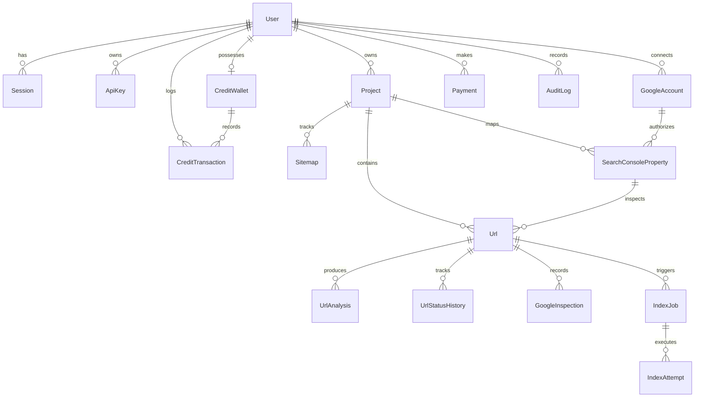
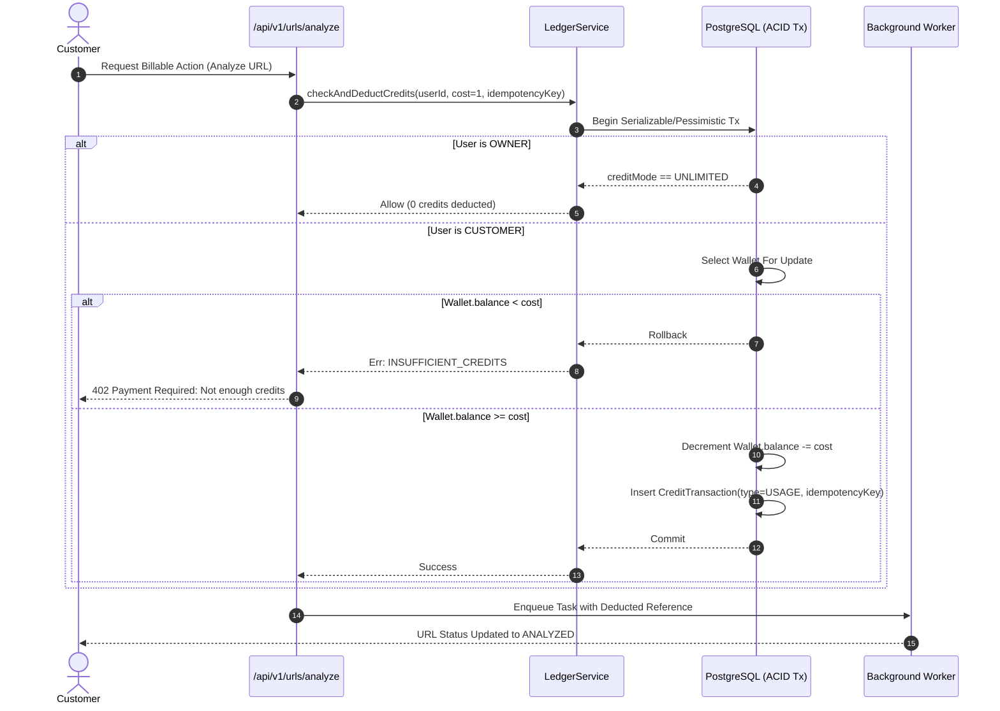

# INDEX MATRIX — SYSTEM ARCHITECTURE & DESIGN SPECIFICATION

## 1. Overview
**INDEX MATRIX** is an enterprise-grade full-stack SEO platform and indexing management SaaS built for website owners, technical SEO agencies, and digital growth teams. It provides deep technical URL accessibility analysis, verified Google Search Console (GSC) integration, URL Inspection API synchronization, capability-aware Google indexing workflows, XML sitemap parsing & monitoring, and credit-based billing backed by an immutable double-entry audit ledger.

---

## 2. High-Level System Architecture

```mermaid
graph TD
    Client[Web Browser / API Client]
    
    subgraph "Frontend Layer (Next.js 14+ / React / Tailwind CSS)"
        Marketing[Public Marketing Site & Docs]
        AuthUI[Authentication & Session Controls]
        CustomerDash[Customer Portal & Workspaces]
        AdminDash[Owner / Admin Operations Center]
        URLManagerUI[Bulk Import & URL Live Table]
        GSCManagerUI[GSC Property & Inspection Viewer]
        LedgerUI[Credit Ledger & Billing History]
    end

    subgraph "API & Service Layer (Next.js Route Handlers)"
        AuthService[Auth & Role-Based Access Control]
        ProjectService[Project & Domain Matching]
        URLService[URL Normalizer & Validator]
        AnalyzerService[SSRF-Hardened URL Analyzer]
        GoogleOAuthService[Google OAuth 2.0 & Token Vault]
        GSCService[Search Console Property & Sitemap Engine]
        InspectionService[Google URL Inspection API Connector]
        IndexingWorkflowService[Capability-Aware Indexing Engine]
        LedgerService[Credit Wallet & Idempotent Ledger]
        PaymentService[Provider-Agnostic Payment Engine]
        APIKeyService[Hashed API Keys & Rate Limiter]
        AuditService[Security Audit Logger]
    end

    subgraph "Data & Persistence Layer"
        Postgres[(PostgreSQL via Prisma ORM)]
        PrismaClient[Prisma Client with Transaction Support]
    end

    subgraph "Asynchronous Queue & Worker Layer"
        RedisServer[(Redis 7+)]
        BullQueue[BullMQ Job Queues]
        WorkerPool[Worker Processes: Analysis, Inspection, Sitemap]
    end

    subgraph "External Providers & APIs"
        GoogleAPI[Google Search Console & Indexing APIs]
        PaymentGateway[Stripe / Razorpay Payment Gateways]
        TargetWebsites[Target Websites for Crawl Analysis]
    end

    Client --> Frontend Layer
    Frontend Layer --> API & Service Layer
    API & Service Layer --> PrismaClient --> Postgres
    API & Service Layer --> BullQueue --> RedisServer
    BullQueue --> WorkerPool
    WorkerPool --> GoogleAPI
    WorkerPool --> TargetWebsites
    API & Service Layer --> PaymentGateway
```

---

## 3. Technology Stack & Component Specifications

| Layer | Technology | Specification / Rationale |
| :--- | :--- | :--- |
| **Framework** | Next.js (TypeScript) | Full-stack architecture, unified frontend and backend REST route handlers |
| **Styling** | Tailwind CSS + Modern Dark Mode | High-contrast, glassmorphic dark theme, accessible semantic UI, zero external bloat |
| **Database** | PostgreSQL | Relational integrity, ACID transactions, robust foreign keys and unique constraints |
| **ORM** | Prisma ORM | Type-safe schema migrations, relation queries, declarative data modeling |
| **Queues** | Redis + BullMQ | Resilient background processing, exponential backoff, rate limits, concurrency controls |
| **Validation** | Zod | Server-side runtime type validation for all payloads and external responses |
| **Auth** | Session/JWT + Argon2/Bcrypt | Constant-time password verification, HttpOnly secure cookies, role-based guards |
| **Google APIs** | OAuth 2.0 + GSC + URL Inspection | Scoped access: `webmasters.readonly`, `indexing`, offline refresh token handling |
| **Security** | SSRF Firewall + DNS Resolution Guard | IP sanitization (RFC 1918, link-local, loopback, cloud metadata blocking) |
| **Testing** | Vitest + Mock Engine | Automated unit, integration, and security regression test suites |

---

## 4. Database Schema Design & Relationships

The relational data model enforces strict data isolation per user, idempotent transactions, and auditable history:



### Key Models & Enums

- **User**: `id`, `email`, `passwordHash`, `name`, `role` (`CUSTOMER` | `OWNER`), `creditMode` (`LIMITED` | `UNLIMITED`), `status` (`ACTIVE` | `SUSPENDED`), timestamps.
- **CreditWallet**: `id`, `userId`, `balance` (Integer >= 0 for customers, ignored/virtual infinity for owners), `lifetimeUsed`, `lifetimePurchased`, `version` (optimistic locking).
- **CreditTransaction**: `id`, `walletId`, `userId`, `amount` (+/- integer), `balanceAfter`, `type` (`PURCHASE`, `USAGE`, `ADMIN_ADD`, `ADMIN_REMOVE`, `REFUND`, `BONUS`, `ADJUSTMENT`), `idempotencyKey`, `reason`, `referenceId`, `createdAt`.
- **Project**: `id`, `userId`, `name`, `domain`, `description`, timestamps.
- **GoogleAccount**: `id`, `userId`, `email`, `encryptedAccessToken`, `encryptedRefreshToken`, `tokenExpiresAt`, `scopes`, `status`, `createdAt`.
- **SearchConsoleProperty**: `id`, `googleAccountId`, `projectId`, `propertyUrl` (e.g. `sc-domain:example.com` or `https://example.com/`), `permissionLevel`, `isVerified`.
- **Url**: `id`, `projectId`, `originalUrl`, `normalizedUrl`, `hostname`, `path`, `status` (`IMPORTED` ... `INDEXED`), `httpStatus`, `lastCrawl`, `lastInspectedAt`, `lastAnalyzedAt`, `matchedPropertyId`.
- **UrlAnalysis**: `id`, `urlId`, `httpStatus`, `redirectChain`, `responseTimeMs`, `contentType`, `title`, `metaDescription`, `robotsMeta`, `canonicalUrl`, `xRobotsTag`, `robotsTxtStatus`, `issues` (JSON), `passedAudit`, `analyzedAt`.
- **GoogleInspection**: `id`, `urlId`, `verdict`, `coverageState`, `indexingState`, `robotsTxtState`, `pageFetchState`, `googleCanonical`, `userCanonical`, `crawledAs`, `lastCrawlTime`, `rawResponse` (JSON), `inspectedAt`.
- **IndexJob**: `id`, `urlId`, `userId`, `operation` (`ANALYZE`, `INSPECT`, `SUBMIT_SUPPORTED`, `SITEMAP_DISCOVERY`), `status` (`PENDING`, `PROCESSING`, `COMPLETED`, `FAILED`), `attempts`, `error`, `idempotencyKey`.

---

## 5. Security & SSRF Protection Architecture

The technical URL analyzer executes external HTTP requests. To completely eliminate SSRF (Server-Side Request Forgery):

1. **Protocol Allowlist**: Only `http:` and `https:` permitted. `file:`, `ftp:`, `gopher:`, `data:` are rejected.
2. **DNS Resolution & IP Validation**:
   - Hostname is resolved via DNS prior to connection.
   - All resolved IPv4 and IPv6 addresses are tested against denylists:
     - `127.0.0.0/8` (Loopback)
     - `10.0.0.0/8`, `172.16.0.0/12`, `192.168.0.0/16` (Private RFC 1918)
     - `169.254.0.0/16` (Link-local / Cloud metadata: AWS, GCP, Azure `169.254.169.254`)
     - `::1`, `fc00::/7`, `fe80::/10` (IPv6 loopback, unique local, link-local)
     - `0.0.0.0/8` (Broadcast / current network)
3. **Redirect Loop & Destination Re-validation**:
   - Maximum 5 redirects tracked.
   - Every intermediate redirect destination must pass full DNS and IP validation before the client follows.
4. **Limits & Timeouts**:
   - Connect timeout: 5s, Read timeout: 8s.
   - Max response body: 2MB (prevents gzip/zip decompression bombs and memory exhaustion).
5. **No Client-side Code Execution**:
   - HTML parsing performed strictly via streaming DOM parser (Cheerio); JavaScript execution is disabled.

---

## 6. Credit Engine & Transaction Ledger



---

## 7. Google Search Console & Indexing Compliance

1. **Property Matching Logic**:
   - **Domain properties (`sc-domain:example.com`)**: Matches any URL whose hostname equals `example.com` or ends with `.example.com` (subdomains). Both HTTP and HTTPS match.
   - **URL-Prefix properties (`https://example.com/blog/`)**: Matches URLs starting with the exact scheme, domain, port, and path prefix.
   - Strict URL normalization applied prior to comparison.
2. **URL Inspection API**:
   - Authorized properties only.
   - Retrieves canonical status, Google index verdict, crawl timestamp, and mobile usability.
   - Clear UI distinction: "Inspected" vs "Submitted" vs "Indexed".
3. **Google Indexing API (Strict Eligibility Guard)**:
   - Validated against Google's official terms: strictly only `JobPosting` and `BroadcastEvent` structured data schemas.
   - Normal content/blog/e-commerce URLs are blocked from the Indexing API with a clear educational message guiding the user to GSC URL Inspection and XML Sitemap discovery.
